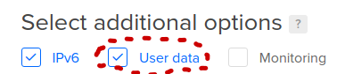
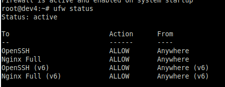

[home](../../../README.md)

# panopset.com Static Content Server Mirror

When creating the digitalocean server, check the 'User data' box,

... and past this in:

Check it, and paste this in

    #!/bin/bash
    apt-get -y update
    apt-get -y install nginx vim net-tools certbot python3-certbot-nginx
    apt-get -y upgrade
    ufw allow OpenSSH
    ufw allow 'Nginx Full'
    ufw enable
    export HOSTNAME=$(curl -s http://169.254.169.254/metadata/v1/hostname)
    export PUBLIC_IPV4=$(curl -s http://169.254.169.254/metadata/v1/interfaces/public/0/ipv4/address)
    echo Droplet: $HOSTNAME, IP Address: $PUBLIC_IPV4 > /usr/share/nginx/html/index.html
    
    
    
Edit your ssh config file

    vim ~/.ssh/config

Add an entry for your new server

    Host static
    HostName <your static content server host or floating ip>
    User root
    IdentityFile ~/.ssh/<your private key file>
    

... and ssh out to it:

    
    ssh $PSS

... verify system is up and running, and that net-tools was installed confirming that the 'User data' script ran okay.  You should also be able to hit the server with a browser and see the default nginx page.

    netstat -tulpn

you should see nginx listening on port 80.

... next, verify the firewall settings are good:

    ufw status
    

... make sure you see something like this

On your dev system, 

    ./userprep.sh $PSS
    ssh $PSS
    ./crtusr.sh

... you should then see:

    authorized_keys
    
    
now, 

    exit

    
...and change the server User from root to your $PAN_USR user in your ssh config.

    vim ~/.ssh/config

    Host static
    HostName <your static content server host or floating ip>
    User <your user id>
    IdentityFile ~/.ssh/<your private key>

... do the update and wq, and then ssh back in to confirm you are logged in as the new user:

    ssh $PSS
    exit
    

Optionally create the nginx server block and [secure](../secureprep.md) it with letsencrypt.  If you decide not to do this, make sure to blank out PAN_STATIC_DOMAIN 
and PAN_DYNAMIC_DOMAIN in your ~/.com.panopset.deploy.properties file.

    
... then prepare (build static = bs.sh) and deploy (deploy static = ds.sh) static content:

    ./bs.sh
    ./ds.sh

Note that if you hit your server directly, the index.html will redirect you to panopset.com.
To hit it from your browser, you need to specify something else, such as:

    http://<your IP>/css/pan.css

... if you had set it up without a domain, or

    https://<your domain>/css/pan.css

... if you had set it up with a domain.

