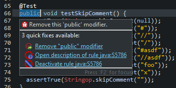
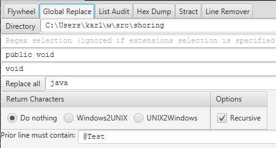

 ~ [home](../../../README.md) ~ [version history](../../../docs/vh.md)

# Global Replace Prior Line Check

Since [1.0.6](../../vh.md).

## A Situation

You're coding along and your Sonar Lint plugin tells you you should remove the public
modifier for JUnit tests.  

... and you have hundreds of these changes to make, in dozens of files.

(I mentioned this rule in one of my [stackoverflow answers](https://stackoverflow.com/questions/39979045/no-public-or-protected-classes-found-to-document-error-from-path-with-accents/64305487#64305487).)

You can't just do a global replace of **public void** with **void** everywhere, of course.
You can write a script or program to only make the replacement if the prior
line contains the @Test annotation, lots of ways to solve this.
Your IDE might solve it for you, but the point here is a general
way to globally replace text, only if the prior line contains a 
given value.

If you have the Panopset Flywheel desktop application handy, you are
less than a minute away from solving it.

## A Solution

* Launch the [Panopset Flywheel](https://panopset.com/download) desktop application.
	
* Select the *Global Replace* tab, and specify **@Test** as the text that the prior line must contain, before doing any replacement.
The other fields are pretty much self explanatory, you'll want to restrict it to java extensions, and specify your project
top level directory, and that **public void** is going to be replaced with **void**.

* Make sure your directory is backed up somewhere and click the "Replace all" button.
